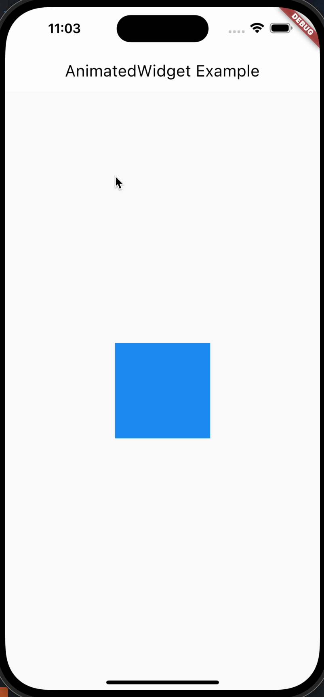

# AnimatedWidget(动画组件)

AnimatedWidget 是一个抽象类，用于简化在动画过程中更新部件的过程。它允许您封装动画逻辑，并将部件更新与动画同步。以下是关于 AnimatedWidget 的详细介绍，包括其属性、功能、用法、使用场景、示例和注意事项。

```dart
  const AnimatedWidget({
    super.key,
    required this.listenable,
  })
```

## 功能

AnimatedWidget 的主要功能是在动画过程中自动重新构建部件。当与 Animation 对象一起使用时，它可以监听动画值的变化，并在动画值变化时重新构建自身，从而自动更新部件的状态。

## 属性

AnimatedWidget 是一个抽象类，没有直接的属性。您需要继承它，并实现 build 方法来创建您自己的动画部件。

## 用法

以下是如何使用 AnimatedWidget 的示例：

```dart
class MyAnimatedWidget extends AnimatedWidget {
  MyAnimatedWidget({Key? key, required Animation<double> animation})
      : super(key: key, listenable: animation);

  @override
  Widget build(BuildContext context) {
    final Animation<double> animation = listenable as Animation<double>;
    return Container(
      width: animation.value *100, // 根据动画值调整宽度
      height: animation.value* 100, // 根据动画值调整高度
      color: Colors.blue,
    );
  }
}
```

## 使用场景

AnimatedWidget 适用于以下场景：

- 当需要在动画过程中更新部件属性时，可以使用 AnimatedWidget 将动画值与部件的状态绑定在一起。

## 注意事项

- AnimatedWidget 本身是抽象类，不能直接使用，您需要继承它并实现 build 方法。
- 如果您的动画逻辑较为复杂，可以考虑使用继承自 AnimatedWidget 的自定义动画部件。

## 示例

以下是一个示例，展示了如何使用 AnimatedWidget 来创建一个简单的缩放动画部件：

```dart
import 'package:flutter/material.dart';

void main() {
  runApp(MyApp());
}

class MyApp extends StatelessWidget {
  @override
  Widget build(BuildContext context) {
    return MaterialApp(
      home: AnimatedWidgetExample(),
    );
  }
}

class AnimatedWidgetExample extends StatefulWidget {
  @override
  _AnimatedWidgetExampleState createState() =>_AnimatedWidgetExampleState();
}

class _AnimatedWidgetExampleState extends State<AnimatedWidgetExample> with SingleTickerProviderStateMixin {
late AnimationController _controller;
  late Animation<double> _animation;

  @override
  void initState() {
    super.initState();
    _controller = AnimationController(vsync: this, duration: Duration(seconds: 1));
    _animation = Tween<double>(begin: 1.0, end: 2.0).animate(_controller);
    _controller.repeat(reverse: true);
  }

  @override
  void dispose() {
    _controller.dispose();
    super.dispose();
  }

  @override
  Widget build(BuildContext context) {
    return Scaffold(
      appBar: AppBar(title: Text('AnimatedWidget Example')),
      body: Center(
        child: MyAnimatedWidget(animation: _animation),
      ),
    );
  }
}

class MyAnimatedWidget extends AnimatedWidget {
  MyAnimatedWidget({Key? key, required Animation<double> animation})
      : super(key: key, listenable: animation);

  @override
  Widget build(BuildContext context) {
    final Animation<double> animation = listenable as Animation<double>;
    return Container(
      width: animation.value *100,
      height: animation.value* 100,
      color: Colors.blue,
    );
  }
}
```



在这个示例中，我们创建了一个继承自 AnimatedWidget 的自定义动画部件 MyAnimatedWidget，并将缩放动画的动画值与部件的状态绑定在一起。
