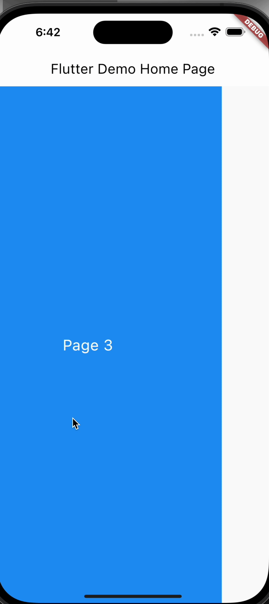

# PageView

PageView 是 Flutter 中的一个滚动视图小部件，用于显示一个可水平滑动的子部件列表。它常用于创建引导页、图片浏览器、卡片式布局等场景。

## 用法

```dart
PageView(
  children: <Widget>[
    // 子部件列表
  ],
)
```

## 属性及功能

1. `children（List<Widget>）`：子部件列表。
   功能：设置 PageView 中的子部件列表，这些子部件会水平排列并可通过滑动进行切换。

2.controller：控制器。
功能：控制 PageView 的滚动和切换操作，通常使用 PageController 对象。

3.scrollDirection：滚动方向。
功能：设置滚动的方向，可以是水平或垂直滚动。

4.reverse（bool）：反转滚动方向。
功能：设置是否反转滚动方向，即从末尾开始滚动。

5.physics：滚动物理效果。
功能：设置滚动的物理效果，例如 BouncingScrollPhysics、ClampingScrollPhysics 等。

6.pageSnapping（bool）：页面对齐。
功能：设置是否将页面对齐到一个固定位置，使页面切换更流畅。

## 使用场景

- 创建引导页，让用户滑动切换不同的页面介绍。
- 实现图片浏览器，允许用户左右滑动切换图片。
- 构建卡片式布局，将不同的卡片排列在一个水平滚动视图中。

## 注意事项

- PageView 默认只会创建当前可见的页面以及一个预加载的页面，其他页面会在滚动中被销毁，适用于大量页面的情况。
- 如果需要创建一定数量的页面，可以通过设置 PageController 的 viewportFraction 属性来控制页面的可见部分。
- 在某些场景下，滚动冲突可能会导致意外的滚动行为，需要注意处理滚动冲突。

## 示例

下面是一个示例，展示如何使用 PageView 创建一个简单的引导页：

```dart
import 'package:flutter/material.dart';

void main() {
  runApp(MyApp());
}

class MyApp extends StatelessWidget {
  @override
  Widget build(BuildContext context) {
    return MaterialApp(
      home: MyGuidePage(),
    );
  }
}

class MyGuidePage extends StatelessWidget {
  final List<Color> colors = [Colors.red, Colors.green, Colors.blue];

  @override
  Widget build(BuildContext context) {
    return Scaffold(
      body: PageView.builder(
        itemCount: colors.length,
        itemBuilder: (context, index) {
          return Container(
            color: colors[index],
            child: Center(
              child: Text(
                'Page ${index + 1}',
                style: TextStyle(fontSize: 24, color: Colors.white),
              ),
            ),
          );
        },
      ),
    );
  }
}
```

如图：



在这个示例中，我们使用 PageView.builder 创建一个简单的引导页。每个页面都有不同的颜色和文本，用户可以通过左右滑动切换页面。
