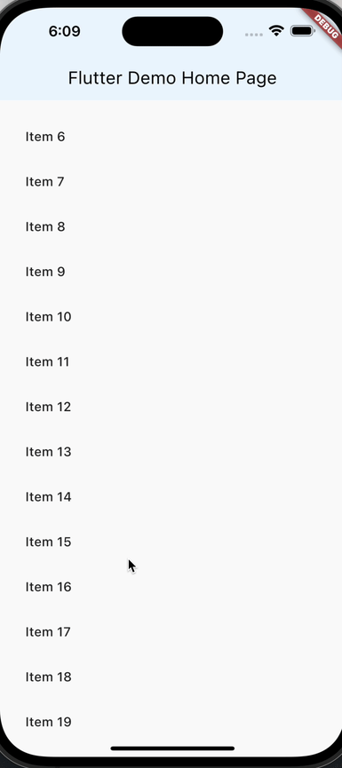

# SingleChildScrollView

> SingleChildScrollView 是 Flutter 中的一个小部件，用于创建一个只能包含单个子部件的滚动视图，当内容超过视图大小时，可以在垂直方向上进行滚动。

## 用法

```dart
SingleChildScrollView(
  child: <Widget>[
    // 子部件，通常是一个需要滚动的内容
  ],
)
```

## 属性及功能

1. scrollDirection：滚动方向。
   功能：设置滚动的方向，可以是垂直或水平方向。

2.reverse（bool）：反转滚动方向。
功能：设置是否反转滚动方向，即从末尾开始滚动。

3.padding（EdgeInsets）：内边距。
功能：设置滚动视图的内边距。

4.primary（bool）：是否占用剩余空间。
功能：设置是否在可用空间内占用剩余空间。

5.physics：滚动物理效果。
功能：设置滚动的物理效果，例如 BouncingScrollPhysics、ClampingScrollPhysics 等。

6.controller：滚动控制器。
功能：设置一个滚动控制器，用于控制滚动视图的滑动位置。

## 使用场景

当内容超过视图大小时，需要在垂直方向上滚动内容。
需要在单个子部件中实现垂直滚动效果。

## 注意事项

- SingleChildScrollView 只能包含一个子部件，如果需要在滚动视图中放置多个子部件，可以考虑使用其他滚动容器，如 ListView、CustomScrollView 等。
- 当内容过长时，使用 SingleChildScrollView 可能会影响性能，因为它会在内存中维护所有子部件，建议使用其他滚动容器来处理大量内容。

## 示例

以下是一个示例，展示如何使用 SingleChildScrollView 创建一个垂直滚动的内容：

```dart
import 'package:flutter/material.dart';

void main() {
  runApp(MyApp());
}

class MyApp extends StatelessWidget {
  @override
  Widget build(BuildContext context) {
    return MaterialApp(
      home: MyScrollPage(),
    );
  }
}

class MyScrollPage extends StatelessWidget {
  @override
  Widget build(BuildContext context) {
    return Scaffold(
      appBar: AppBar(
        title: Text('SingleChildScrollView Example'),
      ),
      body: SingleChildScrollView(
        child: Column(
          children: List.generate(30, (index) {
            return ListTile(
              title: Text('Item ${index + 1}'),
            );
          }),
        ),
      ),
    );
  }
}
```

如图



在这个示例中，我们使用 SingleChildScrollView 创建了一个垂直滚动的内容，其中包含了多个子部件。当内容超过视图大小时，用户可以在垂直方向上进行滚动。
