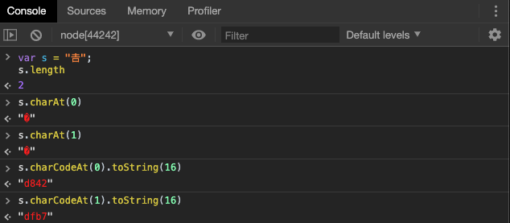
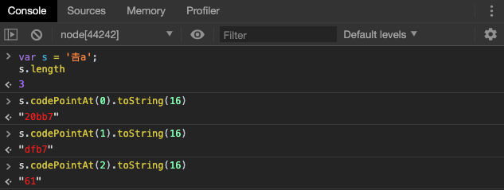

# 字符串新增方法

## String.fromCodePoint()

ES5 提供`String.fromCharCode()`方法，用于从 Unicode 码点返回对应字符，但是这个方法不能识别码点大于`0xFFFF`的字符。


上面代码中，`String.fromCharCode()`不能识别大于`0xFFFF`的码点，所以`0x20BB7`就发生了溢出，最高位`2`被舍弃了，最后返回码点`U+0BB7`对应的字符，而不是码点`U+20BB7`对应的字符。

ES6 提供了`String.fromCodePoint()`方法，可以识别大于`0xFFFF`的字符，弥补了`String.fromCharCode()`方法的不足。在作用上，正好与下面的`codePointAt()`方法相反。


上面代码中，如果`String.fromCodePoint`方法有多个参数，则它们会被合并成一个字符串返回。

> `fromCodePoint`方法定义在`String`对象上，而`codePointAt`方法定义在字符串的实例对象上。

## String.raw()

ES6 还为原生的 String 对象，提供了一个`raw()`方法。该方法返回每一个斜杠都被转义（即斜杠前面再加一个斜杠）的字符串，往往用于模板字符串的处理方法。


在上述例子中，如果直接打印`Hi\n${2+3}!`,`\n`会被理解成为换行符而不是字符串，而经过`String.row()`处理之后的字符串打印时并未换行，说明`\n`被转义成为了`\\n`，原字符串正常输出。

如果原字符串的斜杠已经转义，那么`String.raw()`会进行再次转义。


不难理解，此时我们可以认为，`String.raw()`是为了**确保字符串原样输出**的方法。

## codePointAt()

JavaScript 内部，字符以 UTF-16 的格式储存，每个字符固定为`2`个字节。对于那些需要`4`个字节储存的字符（Unicode 码点大于`0xFFFF`的字符），JavaScript 会认为它们是两个字符。



上面代码中，汉字“𠮷”的码点是`0x20BB7`，UTF-16 编码为`0xD842 0xDFB7`，需要`4`个字节储存。对于这种`4`个字节的字符，JavaScript 不能正确处理，字符串长度会误判为`2`，而且`charAt()`方法无法读取整个字符，`charCodeAt()`方法只能分别返回前两个字节和后两个字节的值。

ES6 提供了`codePointAt()`方法，能够正确处理 4 个字节储存的字符，返回一个字符的码点。



上面代码中，JavaScript 将“𠮷a”视为三个字符，`codePointAt` 方法在第一个字符上，正确地识别了“𠮷”，返回了它的十进制码点 134071（即十六进制的`20BB7`）。在第二个字符（即“𠮷”的后两个字节）和第三个字符“a”上，`codePointAt()`方法的结果与`charCodeAt()`方法相同。

总之，`codePointAt()`方法会正确返回 32 位的 UTF-16 字符的码点。对于那些两个字节储存的常规字符，它的返回结果与`charCodeAt()`方法相同。

你可能注意到了，`codePointAt()`方法的参数，仍然是不正确的。比如，上面代码中，字符`a`在字符串`s`的正确位置序号应该是 1，但是必须向`codePointAt()`方法传入 2。解决这个问题的一个办法是使用`for...of`循环，因为它会正确识别 32 位的 UTF-16 字符。

```javascript
let s = '𠮷a';
for (let ch of s) {
  console.log(ch.codePointAt(0).toString(16));
}
```

`codePointAt()`方法是测试一个字符由两个字节还是由四个字节组成的最简单方法。

```javascript
function is32Bit(c) {
  return c.codePointAt(0) > 0xffff;
}

is32Bit('𠮷'); // true
is32Bit('a'); // false
```

## includes() startWith() 和 endWith()

传统上，JavaScript 只有`indexOf`方法，可以用来确定一个字符串是否包含在另一个字符串中。ES6 又提供了三种新方法。

- **includes()**：返回布尔值，表示是否找到了参数字符串。
- **startsWith()**：返回布尔值，表示参数字符串是否在原字符串的头部。
- **endsWith()**：返回布尔值，表示参数字符串是否在原字符串的尾部。

```javascript
let s = 'Hello world!';

s.startsWith('Hello'); // true
s.endsWith('!'); // true
s.includes('o'); // true
```

这三个方法都支持第二个参数，表示开始搜索的位置。

```javascript
let s = 'Hello world!';

s.startsWith('world', 6); // true
s.endsWith('Hello', 5); // true
s.includes('Hello', 6); // false
```

上面代码表示，使用第二个参数`n`时，`endsWith`的行为与其他两个方法**有所不同**。它针对前`n`个字符，而其他两个方法针对从第`n`个位置直到字符串结束。

## repeat()

`repeat`方法返回一个新字符串，表示将原字符串重复`n`次。

```javascript
'x'.repeat(3); // "xxx"
'hello'.repeat(2); // "hellohello"
'na'.repeat(0); // ""
```

当然，在使用该方法时，参数也会存在**类型的隐式转换**

- 参数如果是小数，会被取整。

  ```javascript
  'na'.repeat(2.9); // "nana"
  ```

- 如果`repeat`的参数是负数或者`Infinity`，会报错。

  ```javascript
  'na'.repeat(Infinity);
  // RangeError
  'na'.repeat(-1);
  // RangeError
  ```

- 但是，如果参数是 0 到-1 之间的小数，则等同于 0，这是因为会先进行取整运算。0 到-1 之间的小数，取整以后等于`-0`，`repeat`视同为 0。

  ```javascript
  'na'.repeat(-0.9); // ""
  ```

- 参数`NaN`等同于 0。

  ```javascript
  'na'.repeat(NaN); // ""
  ```

- 如果`repeat`的参数是字符串，则会先转换成数字。

  ```javascript
  'na'.repeat('na'); // ""
  'na'.repeat('3'); // "nanana"
  ```

## padStart() padEnd()

ES7 提供了字符串补全长度的功能。如果某个字符串不够指定长度，会在头部或尾部补全。`padStart()`用于头部补全，`padEnd()`用于尾部补全。

```js
'x'.padStart(5, 'ab'); // 'ababx'
'x'.padStart(4, 'ab'); // 'abax'

'x'.padEnd(5, 'ab'); // 'xabab'
'x'.padEnd(4, 'ab'); // 'xaba'
```

上面代码中，`padStart`和`padEnd`分别接受两个参数，第一个参数用来指定字符串的最小长度，第二个参数是用来补全的字符串。

如果原字符串的长度，等于或大于指定的最小长度，则返回原字符串。

```js
'xxx'.padStart(2, 'ab'); // 'xxx'
'xxx'.padEnd(2, 'ab'); // 'xxx'
```

如果用来补全的字符串与原字符串，两者的长度之和超过了指定的最小长度，则会截去超出位数的补全字符串。

```js
'abc'.padStart(10, '0123456789');
// '0123456abc'
```

如果省略第二个参数，则会用空格补全长度。

```js
'x'.padStart(4); // '   x'
'x'.padEnd(4); // 'x   '
```

padStart的常见用途是为数值补全指定位数。下面代码生成10位的数值字符串。

```js
'1'.padStart(10, '0'); // "0000000001"
'12'.padStart(10, '0'); // "0000000012"
'123456'.padStart(10, '0'); // "0000123456"
```

另一个用途是提示字符串格式。

```js
'12'.padStart(10, 'YYYY-MM-DD'); // "YYYY-MM-12"
'09-12'.padStart(10, 'YYYY-MM-DD'); // "YYYY-09-12"
```

> 注意，老师的测试环境位 node 12 和 chrome 79，如果同学们不能正常使用`padStart()`和`padEnd()`的特性，请升级浏览器或者打开浏览器的 [实验性功能](chrome://flags/)

## trimStart() trimEnd()

[ES2019](https://github.com/tc39/proposal-string-left-right-trim) 对字符串实例新增了`trimStart()`和`trimEnd()`这两个方法。它们的行为与`trim()`一致，`trimStart()`消除字符串头部的空格，`trimEnd()`消除尾部的空格。它们返回的都是新字符串，不会修改原始字符串。

```javascript
const s = '  abc  ';

s.trim(); // "abc"
s.trimStart(); // "abc  "
s.trimEnd(); // "  abc"
```

上面代码中，`trimStart()`只消除头部的空格，保留尾部的空格。`trimEnd()`也是类似行为。

除了空格键，这两个方法对字符串头部（或尾部）的 tab 键、换行符等不可见的空白符号也有效。

> 请注意，此处的`trim()`并不是我们所熟知的其它语言中，例如 Python 中的 `strip`和 PHP 中的 `trim`，在JavaScript中，它仅只能去除空白符号。

## 小结

在本章中，我们学习了 ES6 和 ES6 + 中新增的几个字符串的对象方法和实例方法，其中：

- 有些方法例如 `String.fromCodePoint()`和`codePointAt()`，要注意其出现是与字符串新增特性相关的，需要联合记忆。
- 剩余的方法大多是语法糖，请同学们尝试思考它们的实现方式。

**预告**：下一章，我们将继续介绍基本数据类型的变化 - 数值的拓展。
