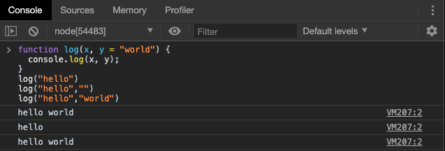
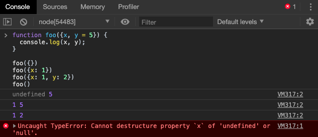
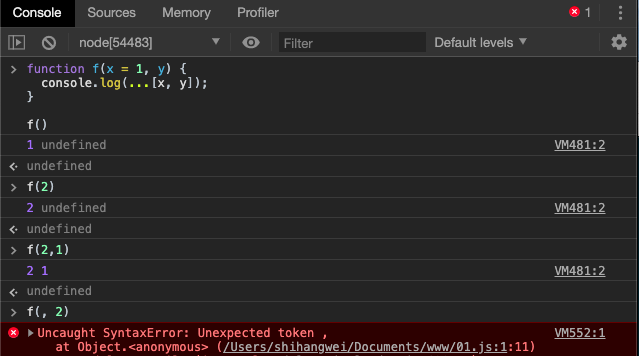
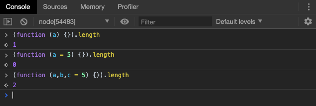
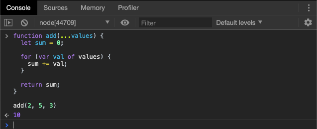

# 函数新方法

## 函数参数的默认值

### 基本用法

ES6 之前，不能直接为函数的参数指定默认值。

```javascript
function log(x, y) {
  y = y || 'World';
  console.log(x, y);
}

log('Hello'); // Hello World
log('Hello', 'China'); // Hello China
log('Hello', ''); // Hello World
```

上面代码检查函数`log`的参数`y`有没有赋值，如果没有，则指定默认值为`World`。这种写法的缺点在于，如果参数`y`赋值了，但是对应的布尔值为`false`，则该赋值不起作用。就像上面代码的最后一行，参数`y`等于空字符，结果被改为默认值。

为了避免这个问题，通常需要先判断一下参数`y`是否被赋值，如果没有，再等于默认值。

```javascript
if (typeof y === 'undefined') {
  y = 'World';
}
```

ES6 允许为函数的参数设置默认值，即直接写在参数定义的后面，在这里的表现就和`Python`的关键字参数类似：



参数变量是默认声明的，由于**在同一个作用域中不能使用`let`对同一变量多次声明**，因而在函数体内，不能使用`let`或者`const`再次声明。


### 与解构赋值默认值结合使用

参数默认值可以与解构赋值的默认值，结合起来使用。



只有当函数`foo`的参数是一个对象时，变量`x`和`y`才会通过解构赋值生成。如果函数`foo`调用时没提供参数，变量`x`和`y`就不会生成，从而报错。通过提供函数参数的默认值，就可以避免这种情况。

```javascript
function foo({ x, y = 5 } = {}) {
  console.log(x, y);
}

foo(); // undefined 5
```

上面代码指定，如果没有提供参数，函数`foo`的参数默认为一个空对象，参数默认值生效，接下来是解构赋值默认值生效。

### 参数默认值的位置

通常情况下，定义了默认值的参数，应该是函数的尾参数。如果非尾部的参数设置默认值，实际上这个参数是没法省略的。



上面的代码中，有默认值的参数不是尾参数，这时，无法省略该参数进行传值，除非显式传入`undefined`。


> 需要注意的是，`null`并不会起到相同的作用，如果传入，直接进行赋值操作，忽略默认值。

### 函数的 length 属性

指定了默认值之后，函数的`length`属性会失真。将返回没有指定默认值的参数个数。



如果设置了默认值的参数不是尾部的参数，那么`length`属性也不再计入后面的参数了。


因为`length` 属性的含义是，该函数预期传入的参数个数，而不是实际传入的参数个数。某个参数指定默认值以后，后期传入的参数个数就不包含这个参数了。

> rest 参数 也不会计入`length`属性。

### 作用域

一旦设置了参数的默认值，我们的`AO`分析就要有所改变，函数进行声明初始化时，参数会形成一个单独的作用域（context）。等到初始化结束，这个作用域就会消失。这种语法行为，在不设置参数默认值时，是不会出现的。

> 这里需要大家回顾 暂时性死区 部分内容，注意区分概念。

```javascript
var x = 1;

function f(x, y = x) {
  console.log(y);
}

f(2); // 2
```

我们来进行`AO`分析。

函数运行前：

- 全局作用域：
  1. 有变量声明 因而 `windows.AO = {x:undefined}`
  2. 有函数声明 因而 `windows.AO = {x:undefined,f:function f}`

代码执行时：

- 全局执行时：

  1. 有赋值操作`x = 1`，因而`windows.AO = {x:1,f:function f}`

- `f`函数执行时：

  1. 形成参数局部作用域`f.params.AO`

  2. 有参数传递赋值 `f(2)`因而 ` f.params.AO = {x:2}`
  3. 默认值变量`x`取值，在本作用域得到了值，因此`f.params.AO={x:2,y:2}`
  4. 函数作用域内无函数声明和变量声明，因而`f.AO={}`。
  5. 执行`console.log(y)`，向上寻找参数局部作用域中的`y`值，所以打印结果为2。

来看下面的例子：

```javascript
let x = 1;

function f(x，y = x) {
  let y = 2;
  console.log(y);
}

f() //报错
```

这是因为在块级作用域对`y`进行了重复声明，在函数声明时，就直接报错。

如果此时，全局变量`x`不存在，就会报错。

```javascript
function f(y = x) {
  let x = 2;
  console.log(y);
}

f(); // ReferenceError: x is not defined
```

此例的解释更为简单，函数执行时，参数作用域中和全局作用域中都找不到`x`的值，因此会直接报错。

下面是一个更复杂的例子。

```javascript
var x = 1;
function foo(
  x,
  y = function () {
    x = 2;
  }
) {
  var x = 3;
  y();
  console.log(x);
}

foo(); // 3
x; // 1
```

我们来进行`AO`分析。

函数运行前：

- 全局作用域：
  1. 有变量声明 因而 `windows.AO = {x:undefined}`
  2. 有函数声明 因而 `windows.AO = {x:undefined,foo:function foo}`

代码执行时：

- 全局执行时：

  1. 有赋值操作`x = 1`，因而`windows.AO = {x:1,foo:function foo}`

- `foo`函数执行时：
  1. 形成参数局部作用域`foo.params.AO`
  2. 默认值变量`x`，`y`，没有实参传递，因此`foo.params.AO={x:undefined,y:function}`
  3. 函数作用域内有变量声明，因而`foo.AO={x:undefined}`。
  4. 执行`x= 3`，修改本作用域`foo.AO = {x:3}`，和参数局部作用域无关。
  5. 执行 `y()`，本作用域没有，向上在参数作用域中找到并执行该函数。
  6. `y` 函数执行赋值操作 `x = 2`，在 `y.AO`上并无 `x`，向上寻找，修改`foo.params.AO={x:2,y:function}`。
  7. 执行打印`x`操作，`foo.AO`中有`x`的值,原样打印为3。

如果将`var x = 3`的`var`去除，`foo`函数执行的步骤发生变化。

```javascript
var x = 1;
function foo(
  x,
  y = function () {
    x = 2;
  }
) {
  x = 3;
  y();
  console.log(x);
}

foo(); // 2
x; // 1
```

我们来进行`AO`分析。

函数运行前：

- 全局作用域：
  1. 有变量声明 因而 `windows.AO = {x:undefined}`
  2. 有函数声明 因而 `windows.AO = {x:undefined,foo:function foo}`

代码执行时：

- 全局执行时：

  1. 有赋值操作`x = 1`，因而`windows.AO = {x:1,foo:function foo}`

- `foo`函数执行时：
  1. 形成参数局部作用域`foo.params.AO`
  2. 默认值变量`x`，`y`，没有实参传递，因此`foo.params.AO={x:undefined,y:function}`
  3. 函数作用域内无变量声明
  4. 执行`x= 3`，本作用域没有`x`，向上修改`foo.params.AO={x:3,y:function}`
  5. 执行 `y()`，本作用域没有，向上在参数作用域中找到并执行。
  6. `y` 函数执行赋值操作 `x = 2`，在 `y.AO`上并无 `x`，向上寻找，修改`foo.params.AO={x:2,y:function}`。
  7. 执行打印操作，打印本作用域中的`x`，本作用域没有，向上寻找，打印`foo.params.AO.x`，值为2。

> 请认真领会分析过程。

## rest 参数

ES6 引入 rest 参数（形式为`...变量名`），用于获取函数的多余参数，这样就不需要使用`arguments`对象了。rest 参数搭配的变量是一个数组，该变量将多余的参数放入数组中。



上面代码的`add`函数是一个求和函数，利用 rest 参数，可以向该函数传入任意数目的参数。

rest 参数可以很好的取代`arguments` 对象。

```javascript
// arguments 的写法
function sortNumbers() {
  return Array.prototype.slice.call(arguments).sort();
}

// rest参数的写法
const sortNumbers = function (...numbers) {
  return numbers.sort();
};
```

> 注意，rest 参数之后不能再有其他参数（即只能是最后一个参数），否则会报错。

## name 属性

参见《对象新特性》中的**方法的name属性** 一章。

## 箭头函数

### 基本用法

ES6 允许使用"箭头"（`=>`）定义函数。

```javascript
var f = v => v;

// 等同于
var f = function (v) {
  return v;
};
```

在数学范畴中，函数其实表示的是参数到返回值的映射关系，在JavaScript中箭头函数的写法更易于理解。

如果箭头函数不需要参数或需要多个参数，就使用一个圆括号代表参数部分。

```javascript
var f = () => 5;
// 等同于
var f = function () {
  return 5;
};

var sum = (num1, num2) => num1 + num2;
// 等同于
var sum = function (num1, num2) {
  return num1 + num2;
};
```

如果箭头函数的代码块部分多于一条语句，就要使用大括号将它们括起来，并且使用`return`语句返回。

```javascript
var sum = (num1, num2) => {
  return num1 + num2;
};
```

需要注意的是，由于大括号被解释为代码块，所以如果箭头函数直接返回一个对象，必须在对象外面加上括号，否则会报错。

```javascript
// 报错
let getTempItem = id => { id: id, name: "Temp" };

// 不报错
let getTempItem = id => ({ id: id, name: "Temp" });
```

箭头函数的一个用处是简化回调函数。

```javascript
// 正常函数写法
[1, 2, 3].map(function (x) {
  return x * x;
});

// 箭头函数写法
[1, 2, 3].map(x => x * x);
```

### 使用注意点

箭头函数有几个使用注意点。

（1）函数体内的`this`对象，就是定义时所在的对象，而不是使用时所在的对象。

（2）不可以当作构造函数，也就是说，不可以使用`new`命令，否则会抛出一个错误。

（3）不可以使用`arguments`对象，该对象在函数体内不存在。如果要用，可以用 rest 参数代替。

（4）不可以使用`yield`命令，因此箭头函数不能用作 Generator 函数。

上面四点中，第一点尤其值得注意。`this`对象的指向是可变的，但是在箭头函数中，它是固定的。

对比:

```javascript
var name = 'window name';
var obj = {
  name: 'obj name',
  getName: function () {
    return function () {
      console.log(this.name);
    };
  },
};
obj.getName()();
// "window name"
```

```javascript
//箭头函数的this作用域遗传自他的生成环境
var name = 'window name';
var obj = {
  name: 'obj name',
  getName: function () {
    return () => {
      console.log(this.name);
    };
  },
};
obj.getName()();
// obj name
```

箭头将`this`绑定所在作用域，而并不是绑定调用时的环境。

`this`指向的固定化，并不是因为箭头函数内部有绑定`this`的机制，实际原因是箭头函数根本没有自己的`this`，导致内部的`this`就是外层代码块的`this`。正是因为它没有`this`，所以也就不能用作构造函数。

所以，箭头函数转成 ES5 的代码如下。

```javascript
// ES6
function foo() {
  setTimeout(() => {
    console.log('id:', this.id);
  }, 100);
}

// ES5
function foo() {
  var _this = this;

  setTimeout(function () {
    console.log('id:', _this.id);
  }, 100);
}
```

上面代码中，转换后的 ES5 版本清楚地说明了，箭头函数里面根本没有自己的`this`，而是引用外层的`this`。

请问下面的代码之中有几个`this`？

```javascript
function foo() {
  return () => {
    return () => {
      return () => {
        console.log('id:', this.id);
      };
    };
  };
}

var f = foo.call({ id: 1 });

var t1 = f.call({ id: 2 })()(); // id: 1
var t2 = f().call({ id: 3 })(); // id: 1
var t3 = f()().call({ id: 4 }); // id: 1
```

上面代码之中，只有一个`this`，就是函数`foo`的`this`，所以`t1`、`t2`、`t3`都输出同样的结果。因为所有的内层函数都是箭头函数，都没有自己的`this`，它们的`this`其实都是最外层`foo`函数的`this`。

除了`this`，以下三个变量在箭头函数之中也是不存在的，指向外层函数的对应变量：`arguments`、`super`、`new.target`。

```javascript
function foo() {
  setTimeout(() => {
    console.log('args:', arguments);
  }, 100);
}

foo(2, 4, 6, 8);
// args: [2, 4, 6, 8]
```

上面代码中，箭头函数内部的变量`arguments`，其实是函数`foo`的`arguments`变量。

另外，由于箭头函数没有自己的`this`，所以当然也就不能用`call()`、`apply()`、`bind()`这些方法去改变`this`的指向。

```javascript
(function () {
  return [(() => this.x).bind({ x: 'inner' })()];
}).call({ x: 'outer' });
// ['outer']
```

上面代码中，箭头函数没有自己的`this`，所以`bind`方法无效，内部的`this`指向外部的`this`。

### 不适用场合

由于箭头函数使得`this`从“动态”变成“静态”，下面两个场合不应该使用箭头函数。

第一个场合是定义对象的方法，且该方法内部包括`this`。

```javascript
const cat = {
  lives: 9,
  jumps: () => {
    this.lives--;
  },
};
```

上面代码中，`cat.jumps()`方法是一个箭头函数，这是错误的。调用`cat.jumps()`时，如果是普通函数，该方法内部的`this`指向`cat`；如果写成上面那样的箭头函数，使得`this`指向全局对象，因此不会得到预期结果。这是因为对象不构成单独的作用域，导致`jumps`箭头函数定义时的作用域就是全局作用域。

第二个场合是需要动态`this`的时候，也不应使用箭头函数。

```javascript
var button = document.getElementById('press');
button.addEventListener('click', () => {
  this.classList.toggle('on');
});
```

上面代码运行时，点击按钮会报错，因为`button`的监听函数是一个箭头函数，导致里面的`this`就是全局对象。如果改成普通函数，`this`就会动态指向被点击的按钮对象。

另外，如果函数体很复杂，有许多行，或者函数内部有大量的读写操作，不单纯是为了计算值，这时也不应该使用箭头函数，而是要使用普通函数，这样可以提高代码可读性。

## 小结

本章重点掌握 ES6 种函数参数的默认值，rest 参数，和箭头函数的使用。

**预告** ：下一章，我们将进入到 ES6 新增的数据结构的学习 - Set Map 和Symbol
