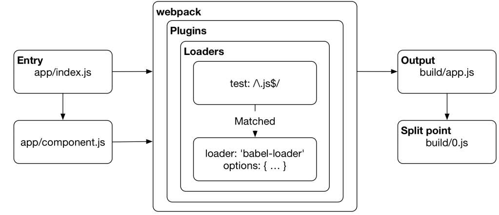

# Webpack

## 第一章 Webpack 简介

Instagram团队在进行前端开发的过程中，发现当项目组成员越来越多的时候，我们会用到很多的js框架和css框架，项目发布打包的时候会变得很麻烦，因此webpack就诞生了。

现今的很多网页其实可以看做是功能丰富的应用，它们拥有着复杂的JavaScript代码和一大堆依赖包。为了简化开发的复杂度，前端社区涌现出了很多好的实践方法

+ 模块化，让我们可以把复杂的程序细化为小的文件;
+ 类似于TypeScript这种在JavaScript基础上拓展的开发语言：使我们能够实现目前版本的JavaScript不能直接使用的特性，并且之后还能能装换为JavaScript文件使浏览器可以识别；
+ Scss，Less等CSS预处理器

这些改进确实大大的提高了我们的开发效率，但是利用它们开发的文件往往需要进行额外的处理才能让浏览器识别,而手动处理又是非常繁琐的，这就为WebPack类的工具的出现提供了需求。

WebPack可以看做是模块打包机：它做的事情是，分析你的项目结构，找到JavaScript模块以及其它的一些浏览器不能直接运行的拓展语言（Scss，TypeScript等），并将其打包为合适的格式以供浏览器使用。

Webpack真正热起来是由于对React中的HMR(Hot Module Replacement)热刷新技术进行了支持，并且现在很好的作为工具为Vue等框架的项目开发提供了支持。



Webpack以项目目录下的index.js作为入口，使用加载器Loader加载不同类型的资源并打包，在打包的过程中可以使用插件对打包内容进行修饰，最后ouput输出一个合并后的文件。非常适合团队合作，迭代，打包，代码分割。

对于开发者而言,Gulp/Grunt是一种能够优化前端的开发流程的工具，而WebPack是一种模块化的解决方案，不过Webpack的优点使得Webpack可以替代Gulp/Grunt类的工具。

> webpack.github.io/

## 第二章 Webpack项目初始化

### 2.1 安装

进入项目文件夹，使用npm初始化项目，生成package.json

```bash
npm init -y
npm install webpack@2 --save-dev
```

webpack会作为依赖安装与我们的项目下。

### 2.2 使用

简单尝试使用webpack

在目录下新建文件夹

```bash
+ 001 + node_modules
      |- package.json
      |- app +
             |-index.js     
```

index.js

```js
console.log('hello world')
```

对该js进行打包操作

```
D:\Material\MarkDown\Web\webpack\code\001>node_modules\.bin\webpack app/index.js ./bulid/index.js
Hash: 2001eaad3629d99e2fbb
Version: webpack 2.6.1
Time: 60ms
   Asset     Size  Chunks             Chunk Names
index.js  2.66 kB       0  [emitted]  main
   [0] ./app/index.js 25 bytes {0} [built] 
```

发现 文件index.js被打包成为了js的模块模式

### 2.3 配置Webpack

运行node_modules下的webpack

```js
D:\Material\MarkDown\Web\webpack\code\001>node_modules\.bin\webpack
No configuration file found and no output filename configured via CLI option.
A configuration file could be named 'webpack.config.js' in the current directory.
Use --help to display the CLI options.
```

我们的项目需要依赖于webpack.config.js文件,该文件即为webpack的配置文件.

接下来尝试针对模块化的js代码进行打包(代码分割)并对webpack.config.js文件进行配置.

在app目录下新增文件并修改index.js

**index.js**

```js
let component = require("./component.js")
document.body.appendChild(component());
```

**component.js**

```js
module.exports = (text = 'hello world')=>{
  const element = document.createElement('div')
  element.innerHTML = text;
  return element
}
```

使用html-webpack-plugin插件快速创建html文件

```
npm install html-webpack-plugin --save-dev
```

我们先把配置复制到根目录下的webpack.config.js中,至于每一段话的内容,我们将会在后边逐一讲解.

**webpack.config.js**

```js

const path = require('path'); //引入path模块
const HtmlWebpackPlugin = require('html-webpack-plugin') //引入html生成模块

const PATHS = {
    app : path.join(__dirname , 'app'), //定义app目录位置为当前目录下的app文件夹
    build : path.join(__dirname , 'build') //定义entry目录位置为当前目录下的entry文件夹
};

module.exports = {

    entry : {
        app : PATHS.app, //入口目录
        //entry是页面入口文件配置，可以是一个文件或者多个入口文件，可以是对象格式或者数组格式。
    },
    output : {
        path : PATHS.build, //输出目录
        filename : "[name].js", //name对应entry的键值,也可以使用[id],[hash]避免重复
        //output 是对应输出项配置,主要包括path,filename和publishPath属性。path代表输出的路径，filename代表输出的文件名称，publishPath代表静态资源发布后的前缀地址。
    },
    plugins : [                 //插件名称和配置
        new HtmlWebpackPlugin({
            title : 'webpack demo',
        }),
    ],
};
```

此时在根目录运行node_modules下的webpack,发现编译成功,我们的具有引用关系的js被合并成为了app.js,并且通过插件生成了html.

因此,我们的代码规则是通过该config文件所配置的.

注意,此时我们更改原有代码并不能改变输出结果,仍然需要编译.

#### html-webpack-plugin的其它参数

html-webpack-plugin中的参数有很多,我们使用常见的几个

```js
{
    filename: 'html/hello.html', //输出文件的文件名称，默认为index.html，不配置就是该文件名；此外，还可以为输出文件指定目录位置（例如'html/index.html'）
        //关于filename补充两点：
        //1、filename配置的html文件目录是相对于webpackConfig.output.path路径而言的，不是相对于当前项目目录结构的。
        //2、指定生成的html文件内容中的link和script路径是相对于生成目录下的，写路径的时候请写生成目录下的相对路径。
    template: './src/index.html',//本地模板文件的位置，支持加载器(如handlebars、ejs、undersore、html等)
    inject: true,//向template中注入所有静态资源，不同的配置值注入的位置不经相同。
        //1、true或者body：所有JavaScript资源插入到body元素的底部
        //2、head: 所有JavaScript资源插入到head元素中
        //3、false： 所有静态资源css和JavaScript都不会注入到模板文件中
    favicon: './src/favicon/fav.icon',//添加特定favicon路径到输出的html文档中，这个同title配置项，需要在模板中动态获取其路径值
    chunks：["app"]//允许插入到模板中的一些chunk，不配置此项默认会将entry中所有的chunk注入到模板中。在配置多个页面时，每个页面注入的 chunk应该是不相同的，需要通过该配置为不同页面注入不同的thunk；
}
```

### 2.4 webpack编译输出日志

```
Hash: 0bf4dbdb0b0709763ab0 //编译产生的唯一值
Version: webpack 2.6.1 //webpack版本号
Time: 968ms //编译时长
     Asset       Size  Chunks             Chunk Names //生成文件 大小 块号 块名
    app.js    2.93 kB       0  [emitted]  app
index.html  180 bytes          [emitted]
   [0] ./app/component.js 138 bytes {0} [built] //编译用到的文件
   [1] ./app/index.js 82 bytes {0} [built]
Child html-webpack-plugin for "index.html":  //编译用到的插件
       [0] ./~/lodash/lodash.js 540 kB {0} [built]  //插件引起的变化
       [1] ./~/html-webpack-plugin/lib/loader.js!./~/html-web
       [2] (webpack)/buildin/global.js 509 bytes {0} [built]
       [3] (webpack)/buildin/module.js 517 bytes {0} [built]
```

如果日志如上述输出,则编译正常

## 第三章 构建自动刷新的代码

### 3.1 使用快捷方式进行编译

因为我们并没有全局安装全局安装,所以项目内的webpack只能使用bin目录下的文件.
我们可以配置package.json让我们命令行直接使用:

在package.json中的scripts下新添一行

```bash
  "scripts": {
    "test": "echo \"Error: no test specified\" && exit 1",
    "build":"webpack"
  },
```

在命令行运行`npm run`可以看到我们可执行的脚本命令

直接运行 `npm run build` 可以根据`webpack.config.js`文件编译当前目录

四个常用的 npm 脚本有简写形式。

+ npm start是npm run start
+ npm stop是npm run stop的简写
+ npm test是npm run test的简写
+ npm restart是npm run stop && npm run restart && npm run start的简写

### 3.2 配置WDS进行浏览器自动刷新

项目目录下安装`webpack-dev-server`

```
npm install webpack-dev-server --save-dev
```

安装完毕 修改`package.json`

```js
"scripts":{
    "start":"webpack-dev-server --env development",//设置为开发环境
    "build":"webpack --env production" //设置为生产环境
}
//其实直接敲命令即可,我们只是使代码更简洁
```

>`webpack-dev-server`打包的bundle只是存在于内存当中,我们想要输出还需运行`build`命令.

运行 `npm run start` 我们的WDS会启动一个服务器,浏览器访问'127.0.0.1:8080',会显示我们的代码,并且修改后的页面会即时刷新,代码能够动态呈现.

同样，我们可以在两个配置项后面添加 `--open --host 127.0.0.1 --port 8080`即可自动打开页面

**配置WDS端口号**

><https://webpack.js.org/configuration/dev-server/>

默认情况下WDS读取的端口号为全局变量中的数据

在`webpack.config.js`中默认参数为:

```
devServer:{
    host:porcess.env.HOST, //localhost
    port:porcess.env.PORT //8080
}
```

我们只需要修改响应的参数即可修改WDS的端口和主机.

需要注意的是,如果在出口文件夹中没有index.html,我们需要指定出口文件和html-webpack-plugin一致

## 第四章 配置ESLint实现代码规范自动测试

ESLint是检测js代码规范的插件.

>ESLint规则 <http://eslint.cn/docs/rules/>
>新版本的ESLint甚至可以帮助我们进行代码修复

### 4.1 在普通项目中使用

新建项目目录,初始化后安装依赖

`npm install eslint --save-dev`

ESLint可配置的方式有很多

+ javascript: 使用javascript导出一个包含配置的对象
+ YAML: .eslintrc.yaml或者 .eslintrc.yml
+ JSON: .eslintrc.json
+ package.json : 创建eslintConfig属性,所有的配置包含在属性当中

我们在`package.json`中配置脚本

```
scripts:{
    "eslint": "eslint"
}
```

直接在项目中运行,检测代码:

```
 npm run eslint .\app\component.js --cache
```

报错并提示运行`eslint --init` 实现初始化并配置文件,我们按照上述配置方式新建`.eslintrc.js`文件

```js
module.exports = {
  env: { //Environment可以预设好的其他环境的全局变量，如brower、node环境变量、es6环境变量、mocha环境变量等
    browser: true,
    commonjs: true,
    es6: true,
    node: true,
  },
  extends: 'eslint:recommended',
  parserOptions: {
    //ecmaVersion:6, //sLint通过parserOptions，允许指定校验的ecma的版本，及ecma的一些特性
    sourceType: 'module',//指定来源的类型，有两种”script”或”module”
  },
  rules: {
    'comma-dangle': ['error', 'always-multiline'],
    'linebreak-style': ['error', 'windows'],
    'quotes': ['error', 'single'],
    'semi': ['error', 'always'],
    'no-unused-vars': ['warn'],
    'no-console': 0,
  },
};
```

ESLint可以被配置的信息主要分为3类：

+ Environments：你的 javascript 脚步将要运行在什么环境（如：nodejs，browser，commonjs等）中。
+ Globals：执行代码时脚步需要访问的额外全局变量。
+ Rules：开启某些规则，也可以设置规则的等级。

规则的错误等级有三种：

+ 0或'off'：关闭规则。
+ 1或'warn'：打开规则，并且作为一个警告（并不会导致检查不通过）。
+ 2或'error'：打开规则，并且作为一个错误 (退出码为1，检查不通过)。

我们可以使用 `"extends":"eslint:recommended"`来启用推荐的规则，报告一些常见的问题.

继续运行,我们的插件正确读取配置文件并且能够输出错误。

如果我们想让错误自动修正，可在命令的最后一段添加`--fix`

```
npm run eslint .\app\component.js --cache -- --fix
```

### 4.2 在webpack中使用ESLint

安装`eslint-loader`插件到依赖,完成在webpack中的ESlint配置之后即可使用.

moudle对应loader（加载器）的配置，主要对指定类型的文件进行操作.

在webpack中,常用的加载器是`eslint-loader`和`babel-loader`,而plugins用于扩展webpack的功能，相比着loader更加灵活，不用指定文件类型。常用的plugins有三个，`html-webpack-plugin`、`commonChunkPlugin`和`ExtractTextPlugin`。

修改`webpack.config.js`,添加如下字段

```js
module: {
        rules: [  // rules为数组，保存每个加载器的配置
　　　　　　{
　　　　　　　　test: /\.js$/,  // test属性必须配置，值为正则表达式，用于匹配文件
　　　　　　　　loader: 'eslint-loader',  // loader属性必须配置，值为字符串，loader之间用！隔开
　　　　　　　　exclude: /node_module/,  // 对于匹配的文件进行过滤，排除node_module目录下的文件
　　　　　　　　//include: './src'  // 指定匹配文件的范围
                enforce:'pre',//加载器的执行顺序，不设置为正常执行。可选值 'pre|post' 前|后
                options:{  //配置loader的options
                    emitWarning:true,
                }
　　　　　　}
　　　　]　
    }   
```

><http://npm.taobao.org/package/eslint-loader>

我们直接运行`npm run start`，则会在运行脚本之前执行加载器。可以使用eslint运行修复之后再次执行.

## 第五章 配置CSS相关设置

### 5.1 配置基本loader

我们对于css的处理首先要加载两个loader

+ css-loader 处理url()和@import引入的css,如果是外部链接,则不作处理.
+ style-loader 处理style标签中的css代码

安装插件:`npm install css-loader style-loader --save-dev`

配置`webpack.config.js`

```js
module:{
  rules:[
      {
        test:/\.css$/,
        use:['style-loader','css-loader'] //默认的处理顺序为从右到左
      }
  ]
}
```

在app目录下新增文件common.css

```css
body{
  background-color:red;
}
```

将`common.css`引到index.js中

    improt './common.css'

继续执行`npm run start`

### 5.2 css作用域

默认情况下，css作用域是全局的,在团队开发的过程当中,可能会出现重名现象.

我们新建两个文件

**style1**

```css
body{
  background-color:red;
}
.class1{
  color:blue;
}
```

**style2**

```css
body{
  background-color:white;
}
.class1{
  color:red;
}
```

正常情况下,如果我们引入这两个文件,会发现类重名现象,但是webpack的模块化能够帮助我们完成载入

修改component.js

```js
module.exports = (text = '你好 WDS',class1,class2)=>{
    const element = document.createElement('div');
    element.innerHTML = text;
    element.className = class1;

    const p = document.createElement('p');
    p.innerText = 'p line';
    p.className = class2;
    element.appendChild(p);

    return element;
};
```

修改index.js

```js
let component = require('./component.js');
import style1 from './style1.css';
import style2 from './style2.css';
document.body.appendChild(component('hello',style.class1,style2.class1));
```

修改webpack.config.js中css-loader的配置

```js
{
    test:/\.css$/,
    use:['style-loader',{
        loader:'css-loader',
        options:{
            modules:true,//按照模块渲染
        }
    }] //默认的处理顺序为从右到左
}　　　　
```

我们运行`npm run start`查看结果

发现我们的全局的body虽然显示`white`,但是我们的字体文件的颜色却是以文件为准的.因为类名会被赋予一个类似hash的值.

### 5.3 css代码分离

因为我们的css最终会以js的形式打包,而js代码在页面中是最后加载的,所以我们需要将css代码分离.

安装插件`npm install extract-text-webpack-plugin@2.1.2 --save-dev`

><https://github.com/webpack-contrib/extract-text-webpack-plugin>

在webpack.config.js中增加配置

```js
const ExtractTextPlugin = require('extract-text-webpack-plugin');
plugins: [
        new ExtractTextPlugin({
           filename:'[name].css',
           ignoreOrder:true, //忽略检测
        }),
    ],
```

修改rules

```js
 {
    test:/\.css$/,
    use: ExtractTextPlugin.extract({
        fallback: "style-loader",
        use: {
            loader:'css-loader',
            options:{
                modules:"true", 
            }
        }
    })
}　　　
```

use:指需要什么样的loader去编译文件,这里由于源文件是.css所以选择css-loader
fallback:编译后用什么loader来提取css文件

### 5.4 使用sass

如果想要在webpack中使用sass我们的环境中必须具备style-loader,css-loader和gem的sass环境,前面的课程当中,我们已经全局安装了sass,接下来还要用到两个插件

```
npm install node-sass sass-loader --save-dev
```

只需要在提取css的配置中略作修改,即可动态的编译sass

**webpack.config.js**

```js
module.exports = {
    entry:{
        app:"./app/index.js",
        style1:'./app/style1.scss',
        style2:'./app/style1.scss'
    },
    output:{
        path:PATHS.build,
        filename:'[name].js'
    },
    module:{
        rules:[
            {
                test:/\.scss$/,
                use: ExtractTextPlugin.extract({
                    fallback: "style-loader",
                        use: ['css-loader','sass-loader']
                    })
            }
        ]
    },
    plugins: [
        new ExtractTextPlugin({
            filename:'[name].css',
            ignoreOrder:true, //忽略检测
        }),
    ],
    
};
```

## 第六章 深入理解loader

><https://webpack.js.org/concepts/loaders/>

loader的加载顺序是从右到左,从下向上进行的,并不是按照我们代码的读取顺序实施.
比如我们`use:['style-loader','css-loader']`,实际上是

    style-loader(css-loader(input))

先进行css代码的解析,然后对style标签中的css进行解析.

Enforcing Order : 我们可以使用enforce来强制条件的加载顺序

传递参数options : 我们在使用参数传递的时候可以采取options对象传递,同时也可以写成键值对的形式

```javascript
use: {
    loader:'css-loader',
    options:{
        modules:"true", 
    }
}
```

可以写作

```javascript
use:'css-loader?modules=true'
```

## 第七章 文件压缩

webpack在打包之后并未进行代码压缩，我们可以通过配置实现文件压缩

首先我们已经配置好了`npm run build`作为打包环境，打包后的大小会比运行环境下的要小。

同样，我们可以配置插件来完成代码压缩

`npm install babili-webpack-plugin --save-dev`

```javascript
const BabiliPlugin = require('babili-webpack-plugin');
plugins: [
    new BabiliPlugin(),
  ],
```

再次编译，发现代码会变得更小

## 第八章 SourceMap

我们的代码压缩过后反而不利于调试，可以借助配置来获取SourceMap

JavaScript脚本正变得越来越复杂。大部分源码（尤其是各种函数库和框架）都要经过转换，才能投入生产环境。
常见的源码转换，主要是以下三种情况：
　　
+ 压缩，减小体积。比如jQuery 1.9的源码，压缩前是252KB，压缩后是32KB。
+ 多个文件合并，减少HTTP请求数。
+ 其他语言编译成JavaScript。最常见的例子就是CoffeeScript。

这三种情况，都使得实际运行的代码不同于开发代码，除错（debug）变得困难重重。
通常，JavaScript的解释器会告诉你，第几行第几列代码出错。但是，这对于转换后的代码毫无用处。举例来说，jQuery 1.9压缩后只有3行，每行3万个字符，所有内部变量都改了名字。你看着报错信息，感到毫无头绪，根本不知道它所对应的原始位置。
这就是Source map想要解决的问题。

简单说，Sourcemap就是一个信息文件，里面储存着位置信息。也就是说，转换后的代码的每一个位置，所对应的转换前的位置。
有了它，出错的时候，除错工具将直接显示原始代码，而不是转换后的代码。这无疑给开发者带来了很大方便。

我们在webpack.config.js中进行配置


```js
devtool:"source-map"
```
